# Database ER Diagram

Source of truth: [supabase_schema.sql](../supabase_schema.sql). The public schema below is exact for the tables declared by this project. Supabase Auth and Supabase Storage are external managed schemas; only the fields referenced or configured by this repository are shown for those boundary entities.

## Project Tables And Relationships

```mermaid
erDiagram
  AUTH_USERS {
    uuid id PK "Supabase Auth user id; external table"
    text email "used by profile trigger"
    jsonb raw_user_meta_data "full_name source"
  }

  PROFILES {
    uuid id PK "FK references auth.users(id), cascade delete"
    text full_name
    text email "unique"
    bigint credits "default 50"
    timestamptz created_at "default timezone('utc', now()), not null"
  }

  PROJECTS {
    uuid id PK "default gen_random_uuid()"
    uuid user_id FK "references auth.users(id), cascade delete, not null"
    text title "default Untitled Project"
    text audio_url
    jsonb project_state "workflow state document"
    text status "default draft"
    timestamptz created_at "default timezone('utc', now()), not null"
    timestamptz updated_at "default timezone('utc', now()), not null"
  }

  CREDIT_TRANSACTIONS {
    uuid id PK "default gen_random_uuid()"
    uuid user_id FK "references auth.users(id), cascade delete, not null"
    bigint amount "not null; positive add, negative deduct"
    text action "not null"
    text reference_id "Stripe session id or project id"
    timestamptz created_at "default now()"
  }

  CHARACTERS_LIBRARY {
    uuid id PK "default gen_random_uuid()"
    uuid user_id FK "references auth.users(id), cascade delete, not null"
    text name "not null"
    text description
    jsonb images "default []"
    text source
    text sheet_url
    jsonb metadata "default {}"
    timestamptz created_at "default now()"
  }

  LOCATIONS_LIBRARY {
    uuid id PK "default gen_random_uuid()"
    uuid user_id FK "references auth.users(id), cascade delete, not null"
    text name "not null"
    text description
    jsonb images "default []"
    text source
    text sheet_url
    jsonb metadata "default {}"
    timestamptz created_at "default now()"
  }

  STORAGE_BUCKETS {
    text id PK "Supabase Storage; assets bucket inserted by schema"
    text name "assets"
    boolean public "true"
  }

  STORAGE_OBJECTS {
    uuid id PK "Supabase Storage managed"
    text bucket_id FK "assets"
    text name "object path"
    uuid owner "Supabase managed"
    jsonb metadata
    timestamptz created_at
    timestamptz updated_at
  }

  AUTH_USERS ||--o| PROFILES : "profiles.id"
  AUTH_USERS ||--o{ PROJECTS : "projects.user_id"
  AUTH_USERS ||--o{ CREDIT_TRANSACTIONS : "credit_transactions.user_id"
  AUTH_USERS ||--o{ CHARACTERS_LIBRARY : "characters_library.user_id"
  AUTH_USERS ||--o{ LOCATIONS_LIBRARY : "locations_library.user_id"
  STORAGE_BUCKETS ||--o{ STORAGE_OBJECTS : "storage.objects.bucket_id"
```



## Important Non-Relationships

These are intentional parts of the current design:

- `projects` has no physical foreign keys to `characters_library` or `locations_library`.
- Project-specific characters, locations, shots, generated images, and generated videos are embedded in `projects.project_state`.
- Files in the `assets` storage bucket are linked by URL/path strings, not by relational foreign keys.
- Storage paths use project-oriented prefixes such as `<projectId>/images/...`, `<projectId>/videos/...`, `<projectId>/generated/...`, and `<projectId>/sheets/...`; this is a convention, not a database constraint.

## `projects.project_state` JSONB Shape

Default schema value:

```json
{
  "current_step": 1,
  "script": null,
  "characters": [],
  "locations": [],
  "shot_list": [],
  "images": [],
  "videos": []
}
```

Observed application-managed keys:

```json
{
  "current_step": 1,
  "audio_duration_seconds": 0,
  "analysis": {
    "theme": "string",
    "mood": "string",
    "genre": "string",
    "bpm": 0,
    "summary": "string",
    "lyrics": [
      {
        "text": "string",
        "start": 0,
        "end": 0,
        "words": [
          { "word": "string", "start": 0, "end": 0 }
        ]
      }
    ],
    "audio_duration_seconds": 0,
    "transcript_end_seconds": 0,
    "analysis_model": "string"
  },
  "script": {
    "title": "string",
    "mood": "string",
    "storyline": "string",
    "scenes": [],
    "lyrics_timeline": []
  },
  "characters": [
    {
      "id": "number-or-string",
      "name": "string",
      "description": "string",
      "images": [
        {
          "url": "string",
          "label": "string",
          "width": 0,
          "height": 0,
          "box_2d": [0, 0, 0, 0]
        }
      ],
      "source": "ai-or-upload",
      "sheetUrl": "string"
    }
  ],
  "locations": [
    {
      "id": "number-or-string",
      "name": "string",
      "description": "string",
      "images": [
        {
          "url": "string",
          "label": "string",
          "width": 0,
          "height": 0,
          "box_2d": [0, 0, 0, 0]
        }
      ],
      "source": "ai-or-upload",
      "sheetUrl": "string",
      "warning": "string-or-null"
    }
  ],
  "shot_list": [
    {
      "n": "string",
      "p": "string",
      "start": 0,
      "end": 0,
      "duration": 0,
      "lyrics": "string",
      "words": [],
      "characters": [],
      "locations": [],
      "camera": "string",
      "movement": "string",
      "shot_size": "string",
      "beat": "string",
      "source_scene": "string",
      "image_url": "string",
      "image_path": "string",
      "image_prompt": "string",
      "image_error": "string",
      "video_url": "string",
      "video_path": "string",
      "video_prompt": "string",
      "video_duration_seconds": 0,
      "video_generated_at": "timestamp",
      "video_uploaded_at": "timestamp",
      "video_error": "string",
      "video_model": "string",
      "video_operation": "string",
      "video_source_image_used": true
    }
  ],
  "shot_list_meta": {
    "source": "string",
    "coverage_notes": "string",
    "approved_at": "timestamp",
    "required_context": {
      "audio_duration_seconds": 0,
      "script_scenes": 0,
      "transcript_lines": 0,
      "timed_words": 0,
      "characters": 0,
      "locations": 0,
      "veo_durations": [4, 6, 8],
      "max_shot_duration": 8
    }
  },
  "shots_arranged": true,
  "images_approved": true,
  "videos_approved": true,
  "shotstack_export": {
    "renderId": "string",
    "status": "queued-or-rendering-or-done-or-failed",
    "message": "string",
    "resolution": "string",
    "quality": "string",
    "submittedAt": "timestamp",
    "checkedAt": "timestamp",
    "hostedUrl": "string",
    "url": "string"
  }
}
```

## Database Behavior

- `public.handle_new_user()` runs after insert on `auth.users` and inserts a `profiles` row with `id`, `full_name`, and `email`.
- `update_modified_column()` runs before update on `projects` and refreshes `updated_at`.
- RLS is enabled on `profiles`, `projects`, `credit_transactions`, `characters_library`, and `locations_library`.
- The `assets` storage bucket is public for reads; authenticated users can insert, update, and delete objects in that bucket.

## Schema Gaps To Verify

The app calls these RPC functions, but they are not defined in the checked-in `supabase_schema.sql`:

- `add_credits(p_user_id, p_amount)` from the Stripe webhook.
- `deduct_credits(p_user_id, p_amount)` from the credit manager.

If those functions exist only in the remote Supabase database, export them into the schema file to make the database design fully reproducible.
